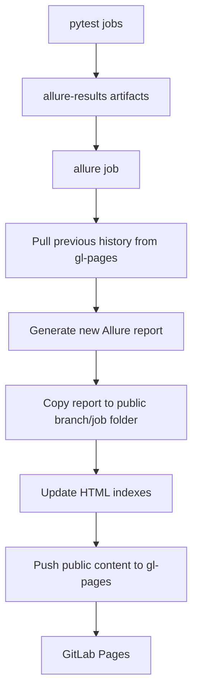

# GitLab Allure History Publisher

Publish pytest Allure reports with preserved history to GitLab Pages, using only GitLab CI and static files.

## Problem

Allure reports are easy to generate in CI, but they are usually temporary job artifacts. That makes it hard to see trends, compare recent runs, or share a stable report link with a team.

GitLab Pages can host static reports, but a useful setup still needs to:

- keep Allure `history` between pipeline runs;
- avoid overwriting previous reports;
- separate reports by branch;
- make old reports easy to find;
- stay simple enough to copy into another project.

## Solution

This repository is a small GitLab CI template for publishing Allure reports with history:

- pytest writes `allure-results`;
- GitLab CI generates an Allure HTML report;
- the previous branch `history` is copied into the next run;
- each report is stored under a branch and job folder;
- static indexes are generated for navigation;
- the final `public/` folder is pushed to a dedicated `gl-pages` storage branch;
- the report job publishes the same `public/` folder to GitLab Pages.

No report server, database, web framework, or external storage service is required.

## Value

- Preserves Allure trend history between GitLab pipeline runs.
- Keeps reports branch-based, so feature branches do not overwrite each other.
- Stores immutable report snapshots per test job.
- Uses GitLab Pages as simple static hosting.
- Keeps blocking quality gates separate from non-blocking demo tests.
- Provides a small HTML index so report history is navigable.
- Stays readable enough to include, copy, and adapt.

## How It Works



Pipeline flow:

1. `test_gate` runs stable tests and blocks the pipeline on failure.
2. `test_demo` runs demonstration tests and is allowed to fail.
3. `allure` downloads test artifacts, restores previous branch history, generates the report, updates indexes, and pushes Pages content.
4. The generated `public/` tree is saved to `gl-pages` for the next run and published as the GitLab Pages artifact.

## Report Storage Layout

Reports are persisted in the `gl-pages` branch:

```text
public/
  index.html
  <env>/
    index.html
    <branch-slug>/
      index.html
      history/
      job_<test-job-id>/
```

- `public/<env>/<branch-slug>/job_<test-job-id>/` is one report snapshot.
- `public/<env>/<branch-slug>/history/` is copied into the next run to preserve Allure trends.
- `public/index.html` lists environment folders.
- `public/<env>/index.html` lists branch folders for that environment.
- `public/<env>/<branch-slug>/index.html` lists reports for that branch.

The open demo pipeline uses `ENV` and `CI_COMMIT_REF_SLUG` for report folders, so the demo branch publishes to paths such as `public/dev/open-demo/`.

## Quick Start

1. Create a GitLab project or mirror this repository to GitLab.
2. Create a storage branch named `gl-pages`.
3. Enable GitLab Pages and make sure GitLab Runner is available for the project.
4. Add test jobs that generate `allure-results` and save it as a CI artifact.
5. Add the reusable template to your `.gitlab-ci.yml`.
6. Add a CI/CD variable named `GIT_PUSH_TOKEN`.
7. Run a pipeline on a normal branch.
8. Open the GitLab Pages URL and navigate through the generated index.

This repository dogfoods the component from the current commit:

```yaml
include:
  - component: $CI_SERVER_FQDN/$CI_PROJECT_PATH/gitlab-allure-history@$CI_COMMIT_TAG
    inputs:
      allure-history-image-tag: $CI_COMMIT_TAG
      build-runtime-image: "true"
    rules:
      - if: $CI_COMMIT_TAG
  - component: $CI_SERVER_FQDN/$CI_PROJECT_PATH/gitlab-allure-history@$CI_COMMIT_SHA
    inputs:
      allure-history-image-tag: "2026.2.6"
    rules:
      - if: $CI_COMMIT_TAG == null

default:
  image: $ALLURE_HISTORY_IMAGE

test_gate:
  stage: test
  script:
    - pytest --alluredir=allure-results
  artifacts:
    when: always
    paths:
      - allure-results
```

Another project can include the component from this repository. Pin a release tag or commit SHA in real projects so CI behavior does not change unexpectedly:

```yaml
include:
  - component: gitlab.com/aleksandr-kotlyar/gitlab-allure-history/gitlab-allure-history@<pinned-version-tag>
    inputs:
      allure-history-image-tag: <pinned-version-tag>
      environment: dev
      pages-branch: gl-pages
      reports-to-keep: "30"

stages:
  - test
  - report

test:
  stage: test
  image: python:3.14.5-alpine
  script:
    - pip install -r requirements.txt
    - pytest --alluredir=allure-results
  artifacts:
    when: always
    paths:
      - allure-results
```

For another project, make sure previous-stage test jobs upload `allure-results/` as artifacts. A test job may also upload a `jobid` file containing the test job ID; when it is absent, the report job uses its own `CI_JOB_ID` for the immutable `job_<id>` snapshot folder.

The default runtime image contains the report helper scripts, Java, Git, Python, and Allure commandline. Set `allure-history-image-tag` to the same value as the pinned component tag, so `@<pinned-version-tag>` uses `registry.gitlab.com/aleksandr-kotlyar/gitlab-allure-history:<pinned-version-tag>`. If you use a project-owned image repository, publish images with the same tags as the component versions, include `generate_index.py` and `prune_reports.py` in the image at `allure-history-tools-dir`, and provide `git`, `python3`, and the `allure` command.

The component includes an opt-in `build_python` job for this repository's release pipeline. With `build-runtime-image: "true"`, it runs only in tag pipelines and builds `$CI_REGISTRY_IMAGE:$CI_COMMIT_TAG`. This repository passes `$CI_COMMIT_TAG` to `allure-history-image-tag` in tag pipelines so the component version and the image tag are the same release value.

## Required GitLab Setup

### `gl-pages` Storage Branch

Create the storage branch before running the report job:

```bash
git checkout --orphan gl-pages
git rm -rf .
mkdir public
touch public/.gitkeep
git add public/.gitkeep
git commit -m "Initialize report storage branch"
git push origin gl-pages
```

The `gl-pages` branch stores previous reports and Allure `history/` data. GitLab Pages itself is deployed by the CI report job with `pages: true` and a `public/` artifact.

### Push Token

Create a project, group, or personal access token with `write_repository` permission and save it as:

```text
GIT_PUSH_TOKEN
```

Recommended settings:

- Masked.
- Protected, if you publish only from protected branches.
- Unprotected, if you intentionally publish reports from feature branches.

The token is used only by the `allure` job to push generated static content back to the `gl-pages` branch.

## Component Inputs And Permissions

Required:

- `GIT_PUSH_TOKEN`: token with permission to push to the repository.

Component inputs:

- `environment`: report environment folder. Defaults to `dev`.
- `allure-history-image`: runtime image repository. Defaults to `registry.gitlab.com/aleksandr-kotlyar/gitlab-allure-history`.
- `allure-history-image-tag`: runtime image tag. Set this to the same pinned tag used in `include:component`.
- `allure-history-tools-dir`: directory inside the CI image containing `generate_index.py` and `prune_reports.py`. Defaults to `/opt/gitlab-allure-history`.
- `pages-branch`: branch used to store generated Pages content and Allure history. Defaults to `gl-pages`.
- `reports-to-keep`: number of report snapshots kept per environment and branch. Defaults to `30`.
- `build-runtime-image`: build and push the runtime image in tag pipelines. Defaults to `"false"` and is intended for this repository's own release pipeline.
- `comment-mr`: post or update a merge request comment with the latest report URL. Defaults to `"false"`. Requires `CI_MERGE_REQUEST_IID` context.

Optional CI variables:

- `ALLURE_HISTORY_INDEX_DESKTOP_BATCH_SIZE`: number of index rows shown before `Show more...` on desktop. Defaults to `25`.
- `ALLURE_HISTORY_INDEX_MOBILE_BATCH_SIZE`: number of index rows shown before `Show more...` on mobile. Defaults to `12`.
- `ALLURE_HISTORY_TOKEN`: token with `api` scope for posting MR comments. Falls back to `CI_JOB_TOKEN` when unset.

Set either index batch size to `0` to show all rows for that viewport without progressive reveal controls.

Provided by GitLab CI:

- `ENV`: used as the report environment folder. Defaults to `dev` in the open demo pipeline.
- `CI_COMMIT_REF_SLUG`: used as the branch report folder.
- `CI_JOB_ID`: used for the report snapshot folder when a previous test job does not provide a `jobid` artifact.
- `CI_PAGES_URL`: used in Allure executor metadata.
- `CI_PIPELINE_URL`: linked from the Allure report metadata.

The GitLab runner also needs network access to:

- pull the CI image;
- clone the `gl-pages` branch;
- push updated Pages content;
- upload the `public/` artifact for GitLab Pages.

## Local Run

Install dependencies:

```bash
python3 -m venv .venv
./.venv/bin/pip install -r requirements.txt
```

Run blocking gate tests:

```bash
./.venv/bin/pytest -m "not demo"
```

Run demo tests:

```bash
./.venv/bin/pytest -m "demo"
```

The demo suite intentionally contains failed, broken, skipped, and passed examples. It is useful for demonstrating Allure output, but it is not meant to be a blocking quality gate.

Generate an index locally:

```bash
python3 generate_index.py public
```

## Key Files

- `.gitlab-ci.yml`: dogfooding GitLab pipeline with this repository's sample tests.
- `templates/gitlab-allure-history.yml`: reusable GitLab CI template for image build, Allure report generation, history reuse, and Pages publishing.
- `Dockerfile`: example runtime image with Python, Java, Git, Allure commandline, and report helper scripts.
- `generate_index.py`: small static HTML index generator for the `public/` report tree.
- `pytest.ini`: pytest markers and Allure result configuration.
- `conftest.py`: minimal pytest fixture example.
- `tests/`: sample gate and demo tests.

## Demo Links

- GitLab mirror: [gitlab.com/aleksandr-kotlyar/gitlab-allure-history](https://gitlab.com/aleksandr-kotlyar/gitlab-allure-history)
- Pages report: [aleksandr-kotlyar.gitlab.io/gitlab-allure-history](https://aleksandr-kotlyar.gitlab.io/gitlab-allure-history/)

## Pinned Version Usage

Use an immutable component version in application projects:

```yaml
include:
  - component: gitlab.com/aleksandr-kotlyar/gitlab-allure-history/gitlab-allure-history@<pinned-version-tag>
    inputs:
      allure-history-image-tag: <pinned-version-tag>
```

Prefer a release tag for normal use, or a full commit SHA when you need maximum immutability. Avoid moving references such as branches or `~latest` for production pipelines because they can change CI behavior without a merge request in the consuming project.

Component release tags also version the default runtime image. When a tag pipeline runs in this repository, it builds and pushes the same tag to the container registry and creates a GitLab release for the component.

## Limitations And Trade-Offs

- Report history depends on a writable `gl-pages` storage branch.
- The CI serializes the Pages publishing job with `resource_group`, but manual pushes to `gl-pages` can still race with CI.
- `CI_COMMIT_REF_SLUG` keeps report paths URL-safe, but different branch names can theoretically normalize to the same slug.
- The CI keeps the latest 30 report snapshots per branch by default.
- This project is a GitLab CI/CD component, not a report portal or framework.

## Troubleshooting

### `gl-pages` Branch Not Found

Create the `gl-pages` branch. It is used as persistent report storage and is cloned by the report job.

### Report Job Cannot Push

Check that `GIT_PUSH_TOKEN` exists, is available to the branch running the pipeline, and has `write_repository` permission.

If the variable is protected, pipelines on unprotected branches cannot use it.

### No Previous History

The first run for a branch has no previous Allure history. The report still publishes, and the next run reuses the generated `history/` folder.

### Pages Index Shows A Slug Instead Of The Original Branch Name

This is expected. The template stores reports by `CI_COMMIT_REF_SLUG` to keep static paths URL-safe.

### Demo Tests Fail

This is expected. `test_demo` is marked `allow_failure: true` in GitLab CI and exists to show how failed and broken tests appear in Allure.

## Roadmap

Useful extensions for real projects:

- tune how many report snapshots are kept per branch;
- ~~add links from merge requests to the latest report;~~ (implemented via `comment-mr` input)
- publish only from selected branches;
- add screenshots or videos as Allure attachments;
- replace the example CI image with a project-owned image.

## License

MIT
