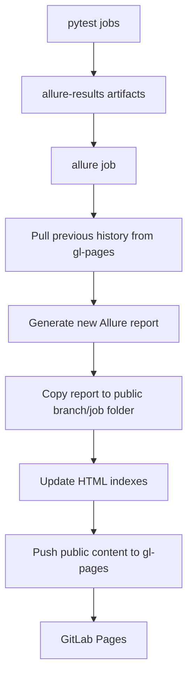

# GitLab Allure History Publisher

[](https://gitlab.com/aleksandr-kotlyar/gitlab-allure-history/-/releases)

Publish pytest Allure reports with preserved history to GitLab Pages, using only GitLab CI and static files. No report server, database, web framework, or external storage service is required.

## Usage

Include the component in your `.gitlab-ci.yml` and pin a release tag. The runtime image tag is resolved from the component version automatically:

```yaml
include:
  - component: gitlab.com/aleksandr-kotlyar/gitlab-allure-history/gitlab-allure-history@2026.2.7
    inputs:
      environment: dev
      pages-branch: gl-pages
      reports-to-keep: "30"

stages:
  - test
  - report

test:
  stage: test
  script:
    - pip install -r requirements.txt
    - pytest --alluredir=allure-results
  artifacts:
    when: always
    paths:
      - allure-results
```

This is the only snippet you need to copy. The component creates an `allure` job that generates the HTML report, preserves history across runs, and publishes to GitLab Pages.

**Prerequisites:**
- A `gl-pages` storage branch (create once, see below)
- A `GIT_PUSH_TOKEN` CI variable with `write_repository` permission
- GitLab Pages enabled for the project

---

## Problem

Allure reports are easy to generate in CI, but they are usually temporary job artifacts. That makes it hard to see trends, compare recent runs, or share a stable report link with a team.

GitLab Pages can host static reports, but a useful setup still needs to:

- keep Allure `history` between pipeline runs;
- avoid overwriting previous reports;
- separate reports by branch;
- make old reports easy to find;
- stay simple enough to copy into another project.

## Solution

- pytest writes `allure-results`;
- GitLab CI generates an Allure HTML report;
- the previous branch `history` is copied into the next run;
- each report is stored under a branch and job folder;
- static indexes are generated for navigation;
- the final `public/` folder is pushed to a dedicated `gl-pages` storage branch;
- the report job publishes the same `public/` folder to GitLab Pages.

## How It Works



Pipeline flow:

1. `test` stage runs your tests and saves `allure-results/`.
2. The `allure` job (from the component) downloads artifacts, restores previous branch history, generates the report, updates indexes, and pushes Pages content.
3. The generated `public/` tree is saved to `gl-pages` for the next run and published as the GitLab Pages artifact.

## Report Storage Layout

Reports are persisted in the `gl-pages` branch:

```text
public/
  index.html
  {environment}/
    index.html
    {branch-slug}/
      index.html
      latest/
        index.html
      history/
      job_NNN/
```

- `public/{environment}/{branch-slug}/latest/` is a stable alias that
  redirects to the newest report snapshot.
- `public/{environment}/{branch-slug}/job_NNN/` is an immutable report
  snapshot for a specific pipeline run.
- `public/{environment}/{branch-slug}/history/` is copied into the next
  run to preserve Allure trends.
- `public/index.html` lists environment folders.
- `public/{environment}/index.html` lists branch folders for that
  environment.
- `public/{environment}/{branch-slug}/index.html` lists reports for
  that branch.

The open demo pipeline uses `ENV` and `CI_COMMIT_REF_SLUG` for report
folders, so the demo branch publishes to paths such as
`public/dev/open-demo/`.

## Latest Report Links

Each branch report folder gets a stable `latest/` alias.

Use:

`https://<pages-domain>/<project>/<environment>/<branch-slug>/latest/`

when you need a stable link to the newest report. The `latest/`
directory contains a lightweight HTML redirect to the most recent
immutable `job_NNN/` snapshot.

Use:

`https://<pages-domain>/<project>/<environment>/<branch-slug>/job_NNN/`

when you need an exact report snapshot for a specific pipeline run.

- `latest/` is a static redirect, not a copy or symlink.
- `job_NNN/` folders are immutable report snapshots.
- `history/` is preserved for Allure trends and is not user-facing.

---

## Detailed Setup

### 1. Create the `gl-pages` Storage Branch

```bash
git checkout --orphan gl-pages
git rm -rf .
mkdir public
touch public/.gitkeep
git add public/.gitkeep
git commit -m "Initialize report storage branch"
git push origin gl-pages
```

The `gl-pages` branch stores previous reports and Allure `history/` data.

### 2. Create a Push Token

Create a project, group, or personal access token with `write_repository` permission and save it as a CI variable named `GIT_PUSH_TOKEN`.

Recommended settings:
- Masked
- Protected, if you publish only from protected branches
- Unprotected, if you intentionally publish reports from feature branches

### 3. Add a Test Job

Your test stage must:
- Run `pytest --alluredir=allure-results`.
- Save `allure-results/` as a CI artifact (use `when: always` so artifacts are saved even on failure).

A test job may also upload a `jobid` file containing the test job ID. When absent, the report job uses its own `CI_JOB_ID` for the `job_NNN` snapshot folder.

### 4. Include the Component

Pin a release tag. The runtime image tag resolves from the component version automatically:

```yaml
include:
  - component: gitlab.com/aleksandr-kotlyar/gitlab-allure-history/gitlab-allure-history@2026.2.7
    inputs:
      environment: dev
```

Set `allure-history-image-tag` explicitly when using a SHA or branch reference, or to override the image tag:

```yaml
include:
  - component: gitlab.com/.../gitlab-allure-history@$CI_COMMIT_SHA
    inputs:
      allure-history-image-tag: "2026.2.7"
```

The component adds an `allure` job that handles report generation, indexing, and publishing.

---

## Versioning And Release Policy

Component version and runtime image tag are released together as a matched pair. When you pin a component release tag (e.g. `@2026.2.7`), the runtime image tag resolves automatically from the component version.

```
Component:  gitlab-allure-history@2026.2.7
Image tag:  allure-history-image-tag: 2026.2.7 (auto-resolved)
```

**Pin the component to a release tag.** The image tag follows automatically.

The version scheme is `YYYY.MINOR.PATCH` (year-based versioning scheme). The full release history is in [CHANGELOG.md](CHANGELOG.md).

### Why Pin?

Never use moving references (branches, `~latest`) for production pipelines. A moving reference can change CI behavior without a merge request in the consuming project, creating silent failures or unexpected behavior.

Prefer a release tag for normal use. Use a full commit SHA when you need maximum immutability (the component resolves `@<sha>` to that commit and the tag pipeline is not required).

### Matching Versions

When you include:

```yaml
  - component: .../gitlab-allure-history@2026.2.7
```

use:

```yaml
    allure-history-image-tag: 2026.2.7
```

The default runtime image is `registry.gitlab.com/aleksandr-kotlyar/gitlab-allure-history:<tag>`. If you use a project-owned image repository, publish images with the same tags as the component versions, and ensure the image contains `generate_index.py`, `prune_reports.py`, `git`, `python3`, and the `allure` commandline.

---

## Component Inputs

| Input | Default | Description |
|-------|---------|-------------|
| `environment` | `dev` | Report environment folder under `public/`. |
| `allure-history-image` | `registry.gitlab.com/...` | Runtime image repository. |
| `allure-history-image-tag` | `$[[ component.version ]]` | Runtime image tag. Auto-resolved when using a tagged component reference. |
| `allure-history-tools-dir` | `/opt/gitlab-allure-history` | Directory with `generate_index.py` and `prune_reports.py`. |
| `pages-branch` | `gl-pages` | Branch that stores Pages content and Allure history. |
| `reports-to-keep` | `30` | Number of report snapshots kept per environment and branch. |
| `build-runtime-image` | `false` | Build and push the runtime image in tag pipelines (for this repo's release pipeline). |
| `comment-mr` | `false` | Post or update a merge request comment with the latest report URL. |

### Optional CI Variables

- `ALLURE_HISTORY_INDEX_DESKTOP_BATCH_SIZE`: index rows before `Show more...` on desktop. Default `25`. Set to `0` for no limit.
- `ALLURE_HISTORY_INDEX_MOBILE_BATCH_SIZE`: index rows before `Show more...` on mobile. Default `12`. Set to `0` for no limit.
- `ALLURE_HISTORY_TOKEN`: token with `api` scope for MR comments. Falls back to `CI_JOB_TOKEN`.

### Provided by GitLab CI

- `ENV`: report environment folder (defaults to `dev`).
- `CI_COMMIT_REF_SLUG`: branch report folder.
- `CI_JOB_ID`: report snapshot folder (when no `jobid` artifact is provided).
- `CI_PAGES_URL`: Allure executor metadata.
- `CI_PIPELINE_URL`: Allure report link.

The runner needs network access to pull the CI image, clone and push the `gl-pages` branch, and upload the `public/` artifact.

---

## How This Repository Uses Itself

This project dogfoods its own component. Tag pipelines use `@$CI_COMMIT_TAG` with the matching image tag. Non-tag pipelines use `@$CI_COMMIT_SHA` with a pinned fallback image tag:

```yaml
include:
  - component: $CI_SERVER_FQDN/$CI_PROJECT_PATH/gitlab-allure-history@$CI_COMMIT_TAG
    inputs:
      allure-history-image-tag: $CI_COMMIT_TAG
      build-runtime-image: "true"
    rules:
      - if: $CI_COMMIT_TAG
  - component: $CI_SERVER_FQDN/$CI_PROJECT_PATH/gitlab-allure-history@$CI_COMMIT_SHA
    inputs:
      allure-history-image-tag: "2026.2.8"
    rules:
      - if: $CI_COMMIT_TAG == null
```

The `build_python` job builds and pushes `$CI_REGISTRY_IMAGE:$CI_COMMIT_TAG` during tag pipelines, so the component version and the runtime image tag are always the same release value.

The repository pipeline reuses the masked `ALLURE_HISTORY_TOKEN` with `api`
scope. The `ci_lint` job uses it to simulate the current pipeline through the
GitLab CI Lint API and verify that the component include expands to the
`allure` job.

---

## Local Run

```bash
python3 -m venv .venv
./.venv/bin/pip install -r requirements.txt

./.venv/bin/pytest -m "not demo"   # blocking gate tests
./.venv/bin/pytest -m "demo"       # non-blocking demo tests
python3 generate_index.py public   # test index generation
```

The demo suite intentionally contains failed, broken, skipped, and passed examples. It is useful for demonstrating Allure output but is not a blocking quality gate.

---

## Key Files

| File | Purpose |
|------|---------|
| `.gitlab-ci.yml` | Dogfooding pipeline |
| `templates/gitlab-allure-history.yml` | Reusable CI component |
| `tests/fixtures/consumer-*` | External consumer contracts executed as child pipelines |
| `Dockerfile` | Runtime image with Python, Java, Git, Allure CLI |
| `generate_index.py` | Static HTML index generator |
| `prune_reports.py` | Removes old report snapshots |
| `pytest.ini` | Pytest markers and Allure config |
| `conftest.py` | Pytest fixtures |
| `tests/` | Gate and demo tests |
| `CHANGELOG.md` | Release history and policy |

The `consumer_contract:*` CI jobs execute every consumer fixture as a child
pipeline against the component at the current commit SHA. Fixtures disable the
publishing job and verify the expanded inputs and upstream artifacts without
changing Pages content.

## Demo Links

- GitLab mirror: [gitlab.com/aleksandr-kotlyar/gitlab-allure-history](https://gitlab.com/aleksandr-kotlyar/gitlab-allure-history)
- Pages report: [aleksandr-kotlyar.gitlab.io/gitlab-allure-history](https://aleksandr-kotlyar.gitlab.io/gitlab-allure-history/)

## Limitations And Trade-Offs

- Report history depends on a writable `gl-pages` storage branch.
- The CI serializes the Pages publishing job with `resource_group` and retries a raced `gl-pages` push up to three times; sustained conflicts still fail the job.
- `CI_COMMIT_REF_SLUG` keeps report paths URL-safe, but different branch names can theoretically normalize to the same slug.
- The CI keeps the latest 30 report snapshots per branch by default.
- This project is a GitLab CI/CD component, not a report portal or framework.

## Troubleshooting

### `gl-pages` Branch Not Found

Create the `gl-pages` branch before running the report job.

### Report Job Cannot Push

Check that `GIT_PUSH_TOKEN` exists, is available to the branch running the pipeline, and has `write_repository` permission. If the variable is protected, pipelines on unprotected branches cannot use it.

### No Previous History

The first run for a branch has no previous Allure history. The report still publishes, and the next run reuses the generated `history/` folder.

### Pages Index Shows A Slug Instead Of The Original Branch Name

This is expected. The template stores reports by `CI_COMMIT_REF_SLUG` to keep static paths URL-safe.

### Demo Tests Fail

This is expected. `test_demo` is marked `allow_failure: true` in GitLab CI and exists to show how failed and broken tests appear in Allure.

## Roadmap

- tune how many report snapshots are kept per branch;
- ~~add links from merge requests to the latest report;~~ (implemented via `comment-mr` input)
- publish only from selected branches;
- add screenshots or videos as Allure attachments;
- replace the example CI image with a project-owned image.

## License

MIT
